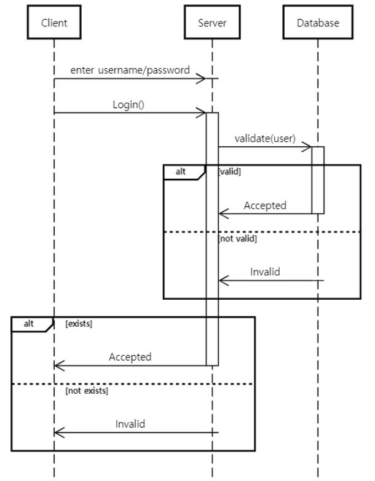
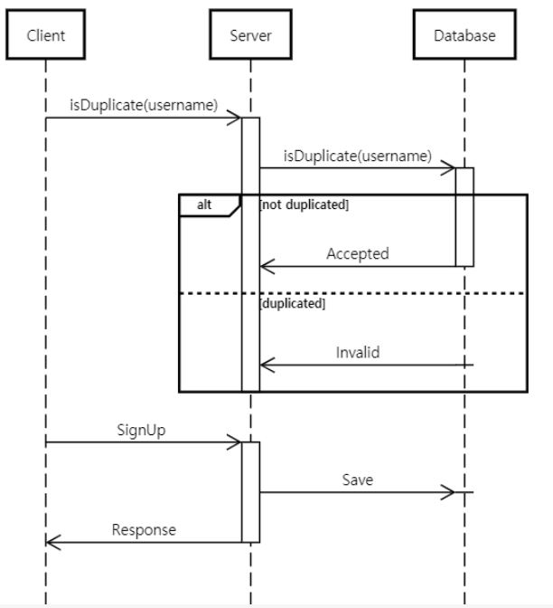
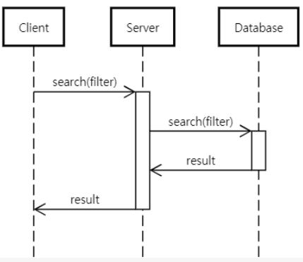
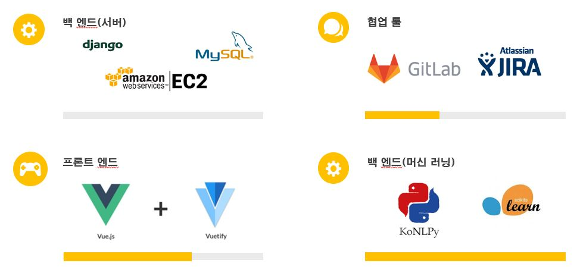

# 이번에 모먹지(이모!)


### [빅데이터 기반 맛집 추천 프로젝트]


---


## Table of Contents

- [이번에 모먹지](#이번에-모먹지(이모!))
  - [Table of Contents](#table-of-contents)
  - [서비스 개요](#서비스-개요)
  - [Introduction](#introduction)
  - [사용기술](#%ec%82%ac%ec%9a%a9%ea%b8%b0%ec%88%a0)
  - [시퀀스 다이어그램](#시퀀스-다이어그램)
  - [My Role](#my-role)
  - [Prerequisite](#prerequisite)
  - [Development](#development)
    - [Install](#install)
    - [Testing](#testing)
    - [Commit](#commit)
  - [시연영상](#시연영상)
  - [Team](#team)
  - [Stack](#stack)
  - [license](#license)
  - [About](#about)
## 서비스 개요


```
- 다이닝코드 46만건의 맛집 데이터로 추천 알고리즘 구현
- 유저가 작성한 리뷰 기반의 맞춤 음식점을 추천
- 식당의 리뷰 내용을 분석하여 비슷한 식당을 추천
```


## Introduction
```
ssafy
|-- PJT
|     `-- backend
|		`-- api
|		`-- backend
|     `-- frontend
|		`-- public
|		`-- src
|-- Algorithm
```


## 사용기술

KNN - UserBased Algorithm

TF-IDF, K-Means - ItemBased Algorithm

Kakao 지도 API : 음식점 위치정보

Vuetify : 반응형 웹


## 시퀀스 다이어그램

#### 1. 로그인



#### 2. 회원가입



#### 3. 검색



##  My Role

```
1. 식당 상세정보 페이지 구현(Kakao 지도 api)
2. 리뷰 페이지 구현(Google chart)
3. 비슷한 식당 추천 페이지
4. 유저맞춤 식당추천 페이지
5. 검색 페이지
```


## Prerequisite
We recommend using [nvm](https://github.com/creationix/nvm) (or [nvm-windows](https://github.com/coreybutler/nvm-windows)) to manage and install Node.js, which makes it easy to change the version of Node.js per project.
- [Yarn](https://yarnpkg.com): We use Yarn to install our Node.js module dependencies (rather than using npm).
- [Git Flow](https://github.com/nvie/gitflow/wiki/Installation): We are following Git Flow for maintaining software versions.
## Development

### Install

```bash
$ git clone https://github.com/Songwonseok/Bigdata_web.git
$ yarn install
```

### How to Run

#### 1. Algorithm

```sh
cd Algorithm
pip install -r requirements.txt
python parse.py
python analyse.py
python visualize.py
```

#### 2. PJT

```sh
cd PJT/backend
pip install -r requirements.txt
python manage.py makemigrations
python manage.py migrate
python manage.py initialize
python manage.py runserver
```

```sh
cd PJT/frontend
npm install
npm run serve
```


## 시연영상

[](https://youtu.be/L_aie8aYVFg)


## Team

- 김민호(데이터)
- 남동해(데이터)
- 송원석(프론트)
- 신광식(프론트)
- 이근성(백엔드)
- 김준목(백엔드)


## Stack



## license
MIT License
## About
Authored and maintained by **ssafy**

