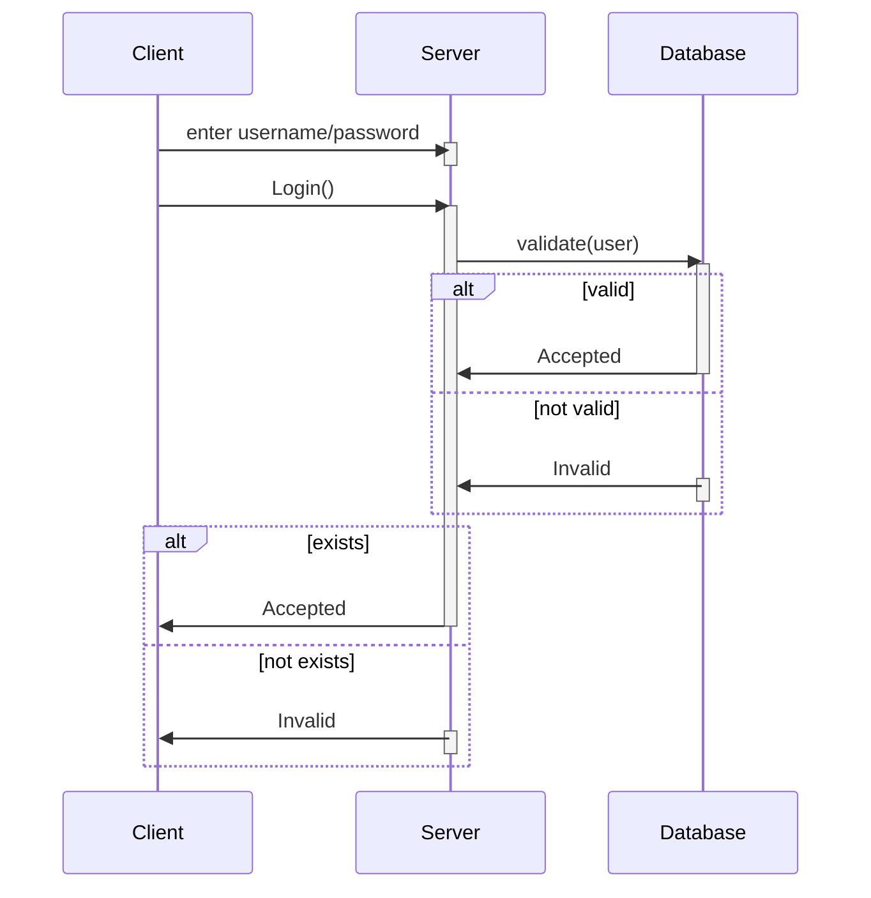
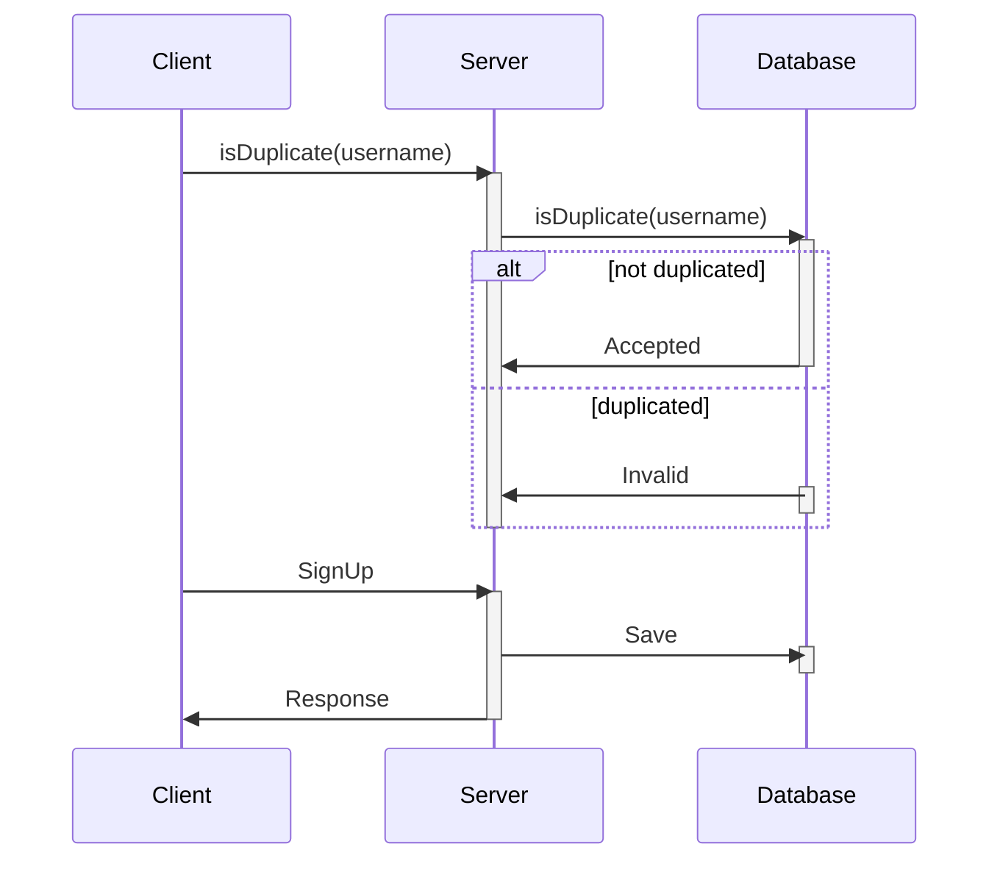
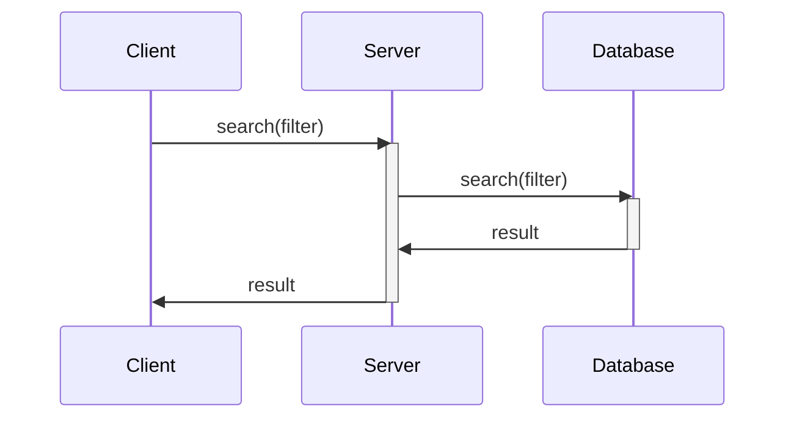
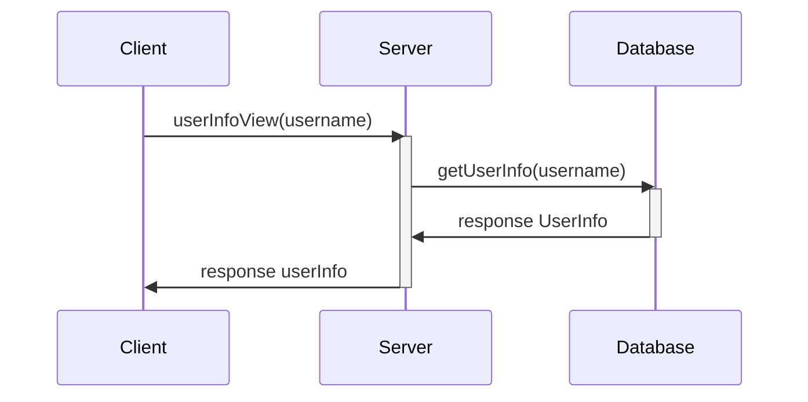
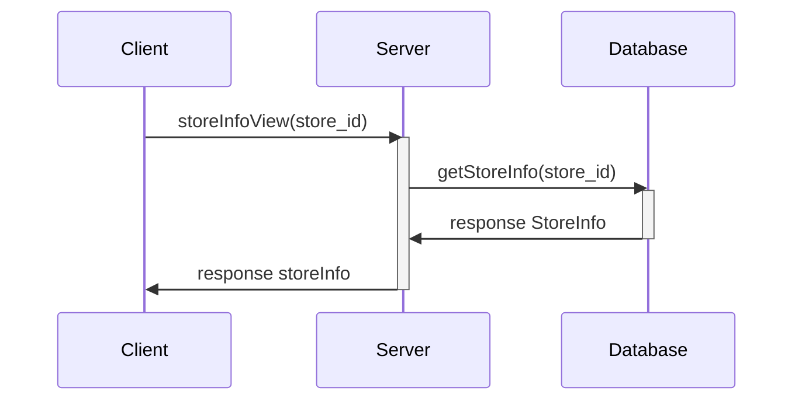

# Sequence Diagram

### 1. 로그인

```	mermaid
sequenceDiagram
	Client ->> Server : enter username/password
	activate Server
	deactivate Server
	
	Client ->> Server : Login()	
	activate Server
	Server ->> Database : validate(user)
	activate Database
	alt valid
		Database ->> Server : Accepted
		deactivate Database
	else not valid
		Database ->> Server : Invalid
		activate Database
		deactivate Database
	end

	alt exists
		Server ->> Client : Accepted
		deactivate Server
	else not exists
		Server ->> Client : Invalid
		activate Server
		deactivate Server
	end
```

### 2. 회원가입

```mermaid
sequenceDiagram
	Client ->> Server : isDuplicate(username)
	activate Server
	Server ->> Database : isDuplicate(username)
	activate Database
    alt not duplicated
        Database ->> Server : Accepted
        deactivate Database
    else duplicated
	    Database ->> Server : Invalid
	    activate Database
	    deactivate Database
    end
	
	deactivate Server
	
	Client ->> Server : SignUp	
	activate Server
	Server ->> Database : Save
	activate Database
	deactivate Database
	Server ->> Client : Response
	deactivate Server
```

### 3. 검색

```mermaid
sequenceDiagram
	Client ->> Server : search(filter)
	activate Server
	Server ->> Database : search(filter)
	activate Database
    Database ->> Server : result
	deactivate Database
	Server ->> Client : result
	deactivate Server
```

### 4. 유저 정보

```mermaid
sequenceDiagram
	Client ->> Server : userInfoView(username)
	activate Server
	Server ->> Database : getUserInfo(username)
	activate Database
    Database ->> Server : response UserInfo
	deactivate Database
	Server ->> Client : response userInfo
	deactivate Server
```

### 5. 음식점 정보

``` mermaid
sequenceDiagram
	Client ->> Server : storeInfoView(store_id)
	activate Server
	Server ->> Database : getStoreInfo(store_id)
	activate Database
    Database ->> Server : response StoreInfo
	deactivate Database
	Server ->> Client : response storeInfo
	deactivate Server
```

